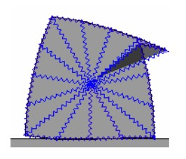

# Soft Body physics

2d game physics engine, supporting soft body physics, written as Master Thesis project for AGH University of Science and Technology.

Showcase application presenting possibilities of the physics engine consist of three simple demos. 

## Running the app
- Build the solution
- Run application `Samples`

